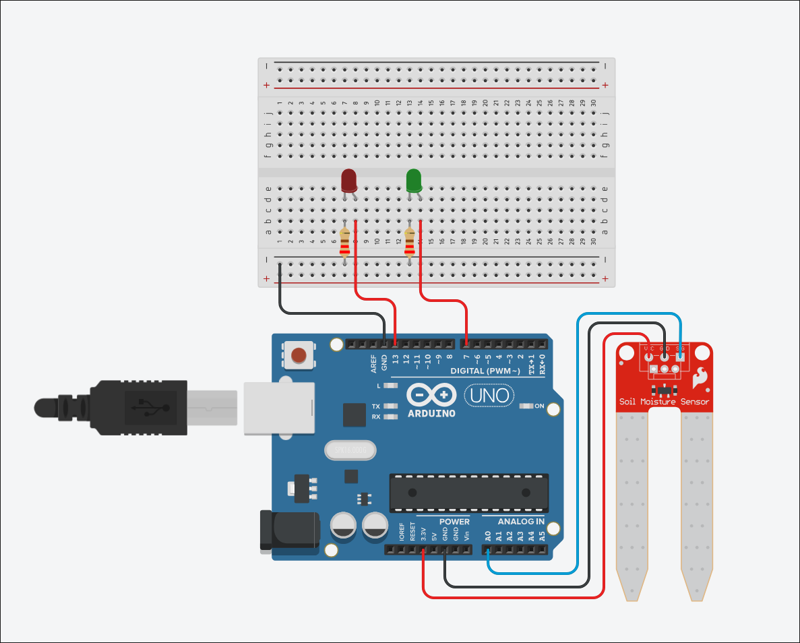

# Monitor de Umidade

Projeto desenvolvido como atividade escolar para demonstrar a integração entre um Arduino e uma aplicação web desenvolvida em Golang. O sistema é capaz de receber leituras de umidade, processá-las e disponibilizá-las em uma interface web para monitoramento.

## Objetivo

Desenvolver um sistema de monitoramento de umidade utilizando um Arduino para gerar as leituras e um servidor em Golang para receber, processar e exibir essas informações em uma página web.

## Tecnologias Utilizadas

### Hardware

* Arduino Uno
* ESP8266 *(projeto original)*
* Sensor de Umidade *(projeto original)*
* LEDs para indicação de status
* Protoboard e jumpers

### Software

* Arduino IDE
* Golang
* HTML
* CSS
* JavaScript
* Git

## Arquitetura do Sistema

```text
   Arduino
      │
      │  
      ▼
Servidor em Go
      │
      ▼
Interface Web
```

## Funcionamento

1. O Arduino gera um valor de umidade.
2. O valor é enviado ao servidor.
3. O servidor recebe e processa a informação.
4. A aplicação web consulta esses dados.
5. O usuário pode visualizar a umidade através da interface.

## Protótipo Digital

O circuito foi desenvolvido no Tinkercad para representar a proposta original do projeto.



O circuíto contém:

* Arduino Uno
* Sensor de umidade
* LEDs indicadores

> **Observação:** O circuito representa a ideia original do projeto. Durante o desenvolvimento não foi possível utilizar o sensor físico, portanto as leituras apresentadas pelo sistema foram simuladas por software no Arduino.

## Protótipo Físico


O protótipo contém:

* Arduino Uno
* LEDs indicadores

> **Observação:** Também durante o desenvolvimento, não foi possível utilizar o módulo de WIFI (ESP8266), portanto o "envio" de dados acontece por meio de um script em python que lê os dados mostrados no serial do arduíno e envia para a API. Para isso ser feito, o Arduíno precisa estar plugado na USB.

## Estrutura do Projeto

```text
projeto/
│
├── firmware/
│   ├── esp8266.ino
│   └── arduino.ino
│
├── api/
│   ├── gateway.py
│   ├── init.sh
│   ├── main.go
│   └── handler.go
│
├── client/
│   ├── index.html
│   ├── style.css
│   └── script.js
│
├── images/
│   ├── tinkercad.png
│   └── prototype.jpg
|
└── README.md
```

## API

### Enviar leitura

**Método:** `POST`

**Endpoint:**

```http
POST /api/sensor
```

**Corpo da requisição:**

```json
{
    "humidity": 68,
    "triggered": false
}
```

**Campos**

| Campo       | Tipo     | Descrição                                                                                     |
| ----------- | -------- | --------------------------------------------------------------------------------------------- |
| `humidity`  | Número   | Porcentagem da umidade medida (ou simulada).                                                  |
| `triggered` | Booleano | Indica se a leitura ultrapassou os limites definidos e deve gerar um alerta na interface web. |


### Consultar última leitura

**Método:** `GET`

```http
GET /api/sensor
```

**Resposta:**

```json
{
    "humidity": 68,
    "triggered": false
}
```


## Como Executar

### Backend

```bash
./init.sh
```

### Arduino

1. Abra o projeto na Arduino IDE.
2. Faça o upload para a placa.
3. Inicie o servidor em Go.
4. Acesse a aplicação web pelo navegador.

## Limitações

O projeto foi originalmente planejado para utilizar um sensor de umidade físico conectado ao Arduino. Entretanto, devido à indisponibilidade do componente durante o desenvolvimento, as leituras foram simuladas diretamente pelo programa do Arduino.

Essa abordagem permitiu validar toda a comunicação entre o Arduino, o servidor em Golang e a interface web, mantendo a mesma arquitetura prevista para o projeto. A substituição da simulação por um sensor real exige apenas a alteração da forma como o valor de umidade é obtido pelo Arduino.

## Resultados

O projeto permitiu validar:

* Comunicação entre o Arduino e o servidor.
* Processamento dos dados recebidos.
* Exibição das informações em uma interface web.
* Funcionamento da arquitetura proposta utilizando dados simulados.

## Conclusão

O projeto demonstrou a integração entre sistemas embarcados e aplicações web utilizando Arduino e Golang. Apesar da ausência do sensor físico, foi possível desenvolver e validar toda a estrutura do sistema por meio da simulação das leituras, demonstrando que a arquitetura está preparada para operar com um sensor real futuramente.

## Integrantes

* Tiago Antônio Furtado
* Mariana Santos Ribeiro
* Nicole Fagundes

## Licença

Projeto desenvolvido exclusivamente para fins acadêmicos.
